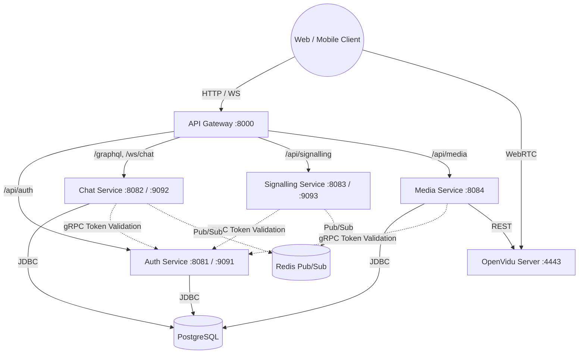

# System Architecture

This document describes the technical design, data flow, and components of the Collab Platform.

## High-Level Architecture Diagram

## Component Breakdown

### 1. API Gateway
- **Technology**: Spring Cloud Gateway (Reactive, Netty)
- **Role**: Single entry point for all external traffic. Handles routing based on URL paths (`/api/auth`, `/graphql`, `/ws`).
- **Scalability**: Can be horizontally scaled; entirely stateless.

### 2. Auth Service
- **Technology**: Spring Boot, Spring Security, JWT, gRPC Server
- **Role**: Issues JWT tokens during login. Provides a gRPC server for other internal microservices to validate tokens asynchronously and securely without calling an HTTP endpoint.
- **Data**: Manages `users` table in the `collab_auth` logical database.

### 3. Chat Service
- **Technology**: Spring Boot, Spring GraphQL, Spring WebSocket (STOMP)
- **Role**: Manages chat rooms and messages. Handles WebSocket connections for real-time text chat delivery. Uses GraphQL to allow clients to fetch structured relational data (like rooms and their messages).
- **Data**: Manages `rooms` and `messages` tables in the `collab_chat` logical database.

### 4. Signalling Service
- **Technology**: Spring Boot, WebSockets (or gRPC streaming)
- **Role**: Facilitates WebRTC connection establishment (SDP Offers, Answers, ICE candidates) between peers before media streams are handed off. 
- **Scale**: Uses Redis Pub/Sub to sync signalling messages across multiple instances of the service.

### 5. Media Service
- **Technology**: Spring Boot
- **Role**: Manages the lifecycle of video/audio sessions. It communicates securely with the OpenVidu server via its REST API to generate session tokens and recording metadata.
- **OpenVidu**: Handles the heavy lifting of WebRTC media routing (SFU - Selective Forwarding Unit).

### 6. Common Module (`:common`)
- **Technology**: Kotlin, Spring Boot starter templates
- **Role**: A shared library used by all microservices containing JWT utilities, common exception classes (`CollabException`, `NotFoundException`), Global Exception Handlers, and shared DTOs.

### 7. Proto Module (`:proto`)
- **Technology**: Protocol Buffers, gRPC, Protoc
- **Role**: Contains the `.proto` schemas defining inter-service communication. Gradle automatically compiles these into Java/Kotlin gRPC stubs that are injected into the microservices.

## Security Flow

1. Client sends `POST /api/auth/login` to Gateway.
2. Gateway routes to Auth Service.
3. Auth Service verifies credentials in PostgreSQL and returns a signed JWT.
4. Client sends `POST /graphql` with `Authorization: Bearer <JWT>`.
5. Gateway routes to Chat Service.
6. Chat Service intercepts request, extracts JWT, and calls Auth Service via internal **gRPC** to validate the token.
7. Upon successful gRPC validation, Chat Service processes the GraphQL request.
